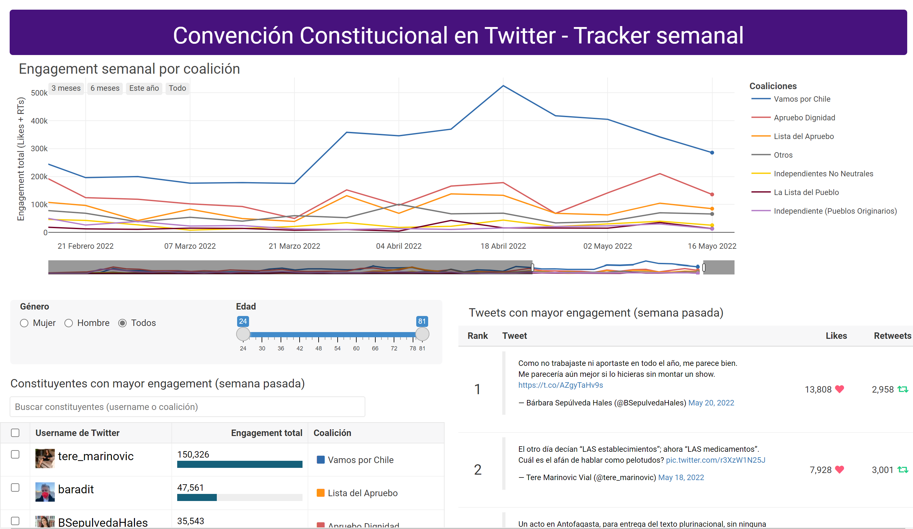

<!-- README.md is generated from README.Rmd. Please edit that file -->

```{r, include = FALSE}
knitr::opts_chunk$set(
  collapse = TRUE,
  comment = "#>",
  fig.path = "man/figures/README-",
  out.width = "100%"
)
```

# twitter-constituyentes

[](https://constituyentes.franciscoyira.com) 

 A Shiny app, deployed on AWS EC2, that tracks and visualises the Twitter posts made by the politicians drafting the new Chilean constitution (constituents), with focus on measuring the engagement they get (likes and retweets).

The app is made up of a `plotly` line chart (top center) that shows trends in total weekly engagement by political coalition (i.e. political party), and two `reactable`s at the bottom that display rankings of constituents and tweets, sorted by the total engagement they got during the last complete week (Monday to Sunday).

There are also filters on the left that allow to filter the constituents ranking by demographic variables (gender and age) and a fast search box that enables looking for constituents by their Twitter handle or coalition name.

The visualisations are linked to each other through Shiny's reactive programming:

-   Selecting a political coalition on the top plotly legend filters the two reactables at the bottom (showing only tweets and constituents from the selected coalition).

-   Demographic filters at the left affect both the ranking of constituents AND the ranking of tweets (it only shows tweets from constituents that match the current demographic filters).

-   It's also possible to select specific constituents (one or many), using the checkboxes on the left of the constituents ranking, to narrow down the ranking of tweets on the right: it will only show tweets from the selected constituents. Unselecting all the checkboxes brings you back the unfiltered tweets ranking.

The ranking of tweets only displays the 12 ones with more engagement, based on the filters currently applied.

## Data Pipeline

The data displayed on the app is refreshed weekly on Tuesday evenings on an AWS S3 bucket. The code that retrieves, wrangles and makes the data available for the app is in this other repo: [`pipeline-twitter-constituyentes`](https://github.com/franciscoyira/pipeline-twitter-constituyentes).

## Deployment

The app is deployed using the [RStudio Server Amazon Machine Image (AMI)](https://www.louisaslett.com/RStudio_AMI/). On this AMI, the repo should be cloned inside `/home/ShinyApps/`, after login in with the user `rstudio` (if you access the RStudio Server GUI you're automatically logged in with that user).

If you want to replicate the deployment you'll also need to:

-   Modify the data pipeline ([`pipeline-twitter-constituentes`](https://github.com/franciscoyira/pipeline-twitter-constituyentes)) to write to S3 buckets where you have write permissions (look for the lines where the package `aws.s3` is used).

-   Modify `app.R` and `source/func_update_rds_df.R` to use a corresponding bucket where you have read permissions.

The bucket to which those scripts point should contain the files `rnk_tweets.rds`, `rnk_total_engagement.rds` and `df_plot_coalitions.rds`, which are the final outputs of the data pipeline (more details on the data pipeline repo).
